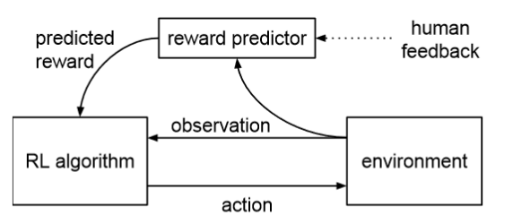

## [Deep Reinforcement Learning from Human Preferences](https://arxiv.org/pdf/1706.03741.pdf)
Deepmind and OpenAI's collab. Use human annotation to train a reward predictor that be decoupled from the reward generated by the environment. This form of training allows for training the agent on alternative objectives different than the one from the environment (E.g Enduro car racing where they ask the agent to lane keep with other cars instead of passing them in the original environment).
Diagram of setup below:

# Experimental Setup

Since the RL algorithms are de-coupled from the reward predictor, two RL algorithms and environments are used for benchmarking. They used A2C (Async Actor-critic) for Mujuco (robot environment), and TRPO (Trust region policy gradient) for Atari.

# Human Annotation Collection
* Human annotator is shown videos of two trajectories side-by-side, they select one of the two as better
* trajectory length for Atari was 25 time steps ( 1.7 seconds at 15fps)
* Human annotator have an option to select "tied"
* each human annotation is stored as a triple, $(\sigma^{1},\sigma^{2},\mu)$, where $\sigma^{1},\sigma^{2}$ are the two comparison choice trajectories, and $\mu$ represents the human annotator's choice, which can be left $[1, 0]$, tied $[0.5,0.5]$ or right $[0, 1]$.

# Reward Predictor
* Built as a neural network, can be Conv Net or MLP, input is multi-frames of state observation stacked together (4-frame stack) like what was done for the Q-network in DQN
* Trained to minimize the Cross-entropy loss between the predictor's prediction and the annotation preference $\mu$
* An ensemble of reward predictors are trained,each of their predictions are independently normalized and averaged to give the final reward prediction $\hat{r}$
* They assume 10% times the human annotator selects labels by chance, this accounts for error in human annotation
* Use a small held-out dataset for validation of the reward Predictors
