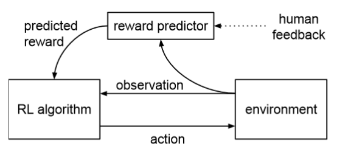

#[Deep Reinforcement Learning from Human Preferences](https://arxiv.org/pdf/1706.03741.pdf)
Deepmind and OpenAI's collab. Use human annotation to train a reward predictor that override the reward from the environment.
Diagram below:

